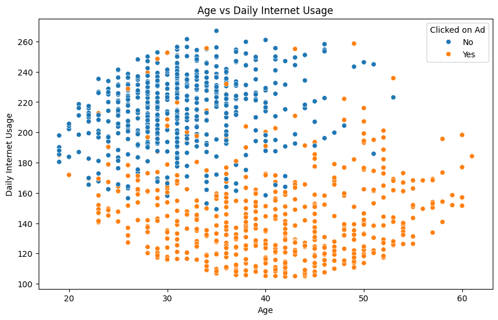
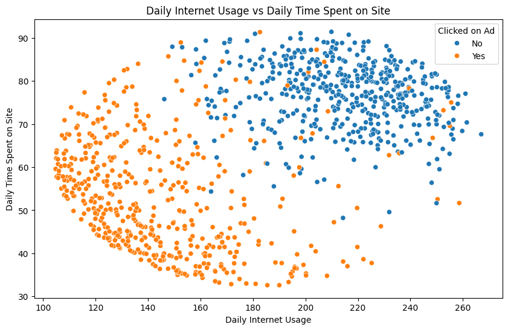
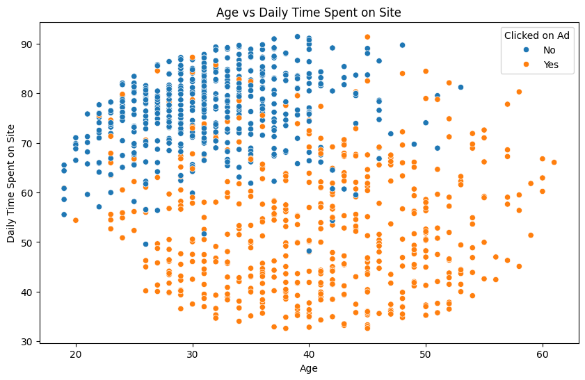
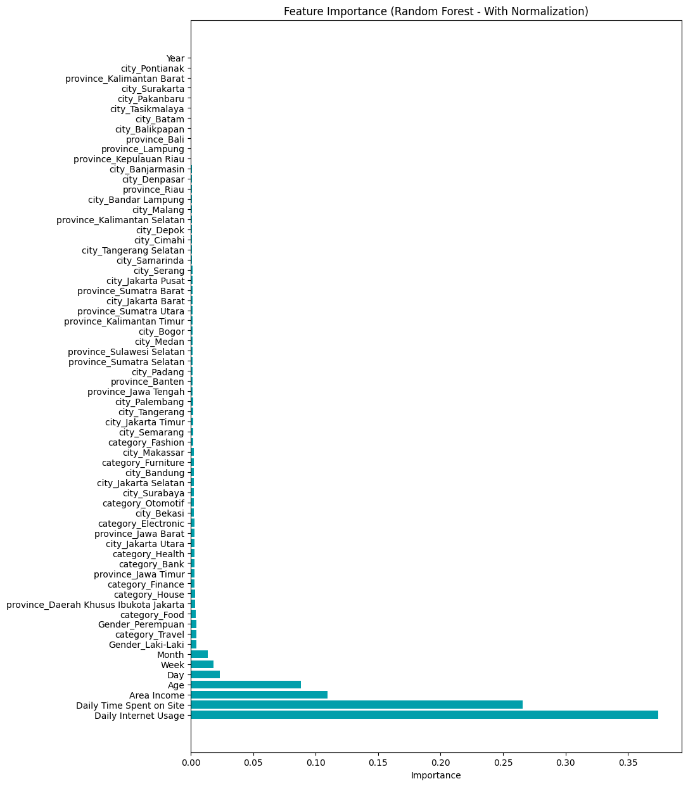

# Customer Ads Click Classification
Predict Customer Clicked Ads Classification by Using Machine Learning.

## Introduction
A company wants to know the effectiveness of an advertisement that they serve, this is important for companies engaged in digital marketing consultants in order to know how much the advertisement is marketed so that it can attract customers to see the advertisement. In this project, I was assigned as a member of the company's data team. I am responsible for finding insights related to user behavior from the data by creating visualizations, creating machine learning that is relevant to the company's needs, and making recommendations from the findings obtained.

## Table of Contents
1. [Business Problem](#business-problem)
2. [Objective](#objective)
3. [Data](#data)
4. [Exploratory Data Analysis (EDA)](#exploratory-data-analysis-eda)
5. [Data Cleaning & Preprocessing](#data-cleaning--preprocessing)
6. [Machine Learning Modeling](#machine-learning-modeling)
7. [Model Evaluation](#model-evaluation)
8. [Feature Importance](#feature-importance)
9. [Business Recommendations](#business-recommendation)

## Business Problem
A company in digital marketing would like to understand how customers respond to the ads they serve online. Every time an ad is seen by a user, only a small percentage of users actually click on the ad, and the company does not have a clear understanding of what factors influence this decision. Failure to identify customer behavior can lead to high advertising costs without delivering satisfactory results. Therefore, companies need in-depth analysis to identify user behavior patterns and determine what elements are most effective in attracting customers to click on ads. 

If it isn't handled, this problem can lead to:
- Inefficient marketing budget.
- Ads that are irrelevant or uninteresting to the target audience.
- Difficulty in determining data-driven marketing strategies to increase ad engagement.

## Objective
The objective of this project is to help companies analyze the effectiveness of advertisements and understand the factors that influence users' decision to click on advertisements. Specifically, this project aims to:
- Create visualizations from the dataset to explore user behavior towards ads.
- Build a machine learning model that can predict whether a user will click on an ad based on the available data.
- Identify features or variables that most influence a user's decision to click on an ad.
- Provide data-driven recommendations that can help companies improve the effectiveness of their advertising campaigns.

## Data
This project uses [Clicked Ads Dataset.csv](data/Clicked%20Ads%20Dataset.csv) data which can be accessed in folder data. The features in this dataset are Unnamed: 0, Daily Time Spent on Site, Age, Area Income, Daily Internet Usage, Male, Timestamp, Clicked on Ad, city, province, category.

## Exploratory Data Analysis (EDA)
The EDA process consists of several stages, including the following:
- **Quick EDA:** Check the number of rows and columns, check the dataset column information, check for missing data, and check for duplicate data. 
- **Statistical Summaries:** Viewing summary statistics for both numerical and categorical features. 
- **Univariate Analysis:** Analysis is done by using visualization of data distribution for each column, both numerical and categorical columns. 
- **Bivariate Analysis:** Performed analysis using visualization to see the relationship between Age, Daily Internet Usage, and Daily Time Spent on Site columns. 
- **Multivariate Analysis:** Analysis was conducted using visualization of the correlation matrix for each feature.

Early insight from the data:
1. Both groups of users (those who clicked and did not click on the ads) had very similar age ranges and daily internet usage.
    

2. The two groups of users (those who clicked and those who did not click on the ads) had very similar ranges of daily internet usage and time on site.
    

3. Both users who click and do not click on ads tend to have a relatively uniform distribution of age and time on site within a certain range.
    

## Data Cleaning & Preprocessing
Based on the results of the Exploratory Data Analysis stage, there are missing values in the columns 'Daily Time Spent on Site', 'Area Income', 'Daily Internet Usage', and 'Male'. In addition, there is no duplicate data. Missing values in the Daily Time Spent on Site, Area Income, Daily Internet Usage features will be filled using the mean. While in the Male feature, the missing value data will be deleted.

In the data preprocessing stage, several processes are carried out, including the following
- **Drop Features** Remove unnecessary features such as 'Unnamed: 0'. 
- **Feature Encoding:** This process is done with the one-hot encoding method using get dummy.
- **Split Data Feature:** Separates the target attribute from the feature. The target attribute is 'Clicked on Ad'.
- **Extraction Datetime:** Extracts the 'Timestamp' feature into 'Year', 'Month', 'Week', 'Day' features. Then after extracting, the 'Timestamp' feature will be deleted.

## Machine Learning Modeling
Before training the model, split the data into train set and test set (size is 20%). Train the model with 3 different algorithms and take two experiments for each algorithm (without normalization and with normalization). The three algorithms used are as follows.
- Logistic Regression
- Decision Tree 
- Random Forest

## Model Evaluation
| Model  | Accuracy | 
| ------------- |:-------------:|
| Logistic Regression (Without Normalization)               | 70.5%     |
| Decision Tree (Without Normalization)                     | 93%       |
| Random Forest (Without Normalization)                     | 95.5%     |
| Logistic Regression (With Normalization)                  | 95.5%     |
| Decision Tree (With Normalization)                        | 93%       |
| Random Forest (With Normalization)                        | 95.5%     |

## Feature Importance
Visualization of feature importance for Random Forest model with normalization is as follows.

Based on both experimental results, the feature importance generated from the model that has the highest accuracy is Daily Internet Usage, Daily Time Spent on Site, Area Income, Age, and Day.

## Business Recommendation
Business recommendations based on Feature Importance are as below.
- 'Daily Internet Usage' and 'Daily Time Spent on Site' are the most important features in determining ad success. I recommend targeting users who have higher internet usage time, as they are more likely to engage with ads.
- 'Area Income' is also an important factor. Users with higher incomes are likely to be more interested in premium products or services. 
- The 'Age' factor shows that the age of the user is also influential in targeting ads. Ads can be more customized for certain age groups, especially those who click on ads more frequently.
- The use of 'Week' and 'Month' as features suggests that certain times of the week and month could be the best times to increase ad conversions.

